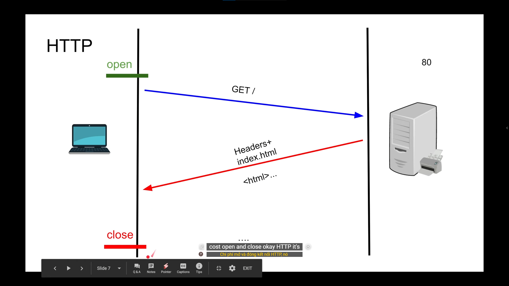
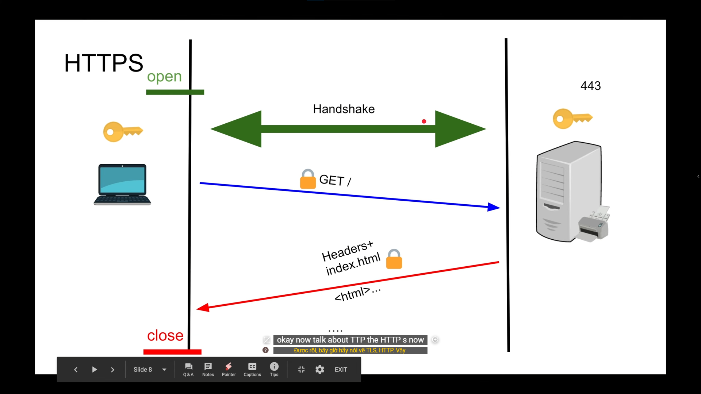
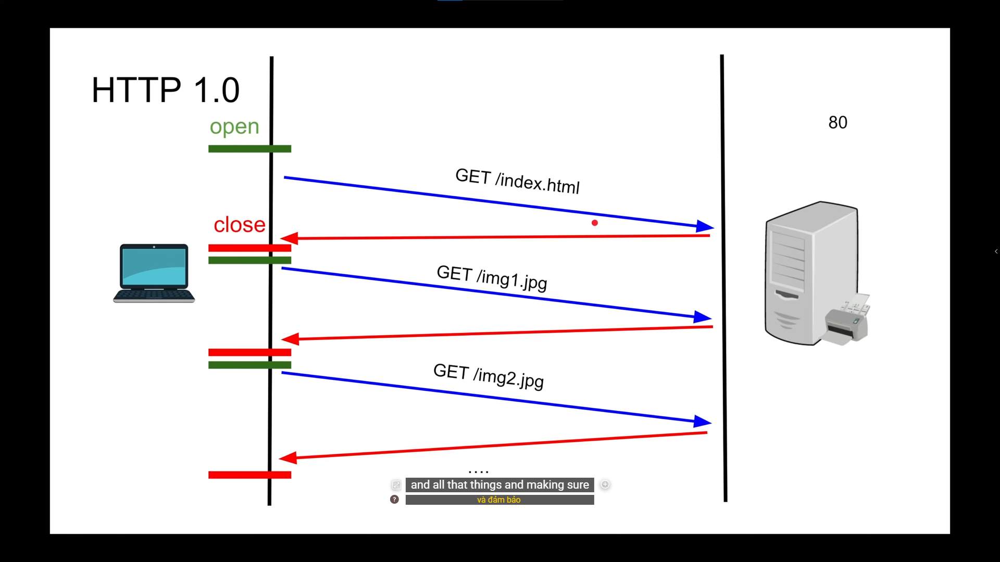
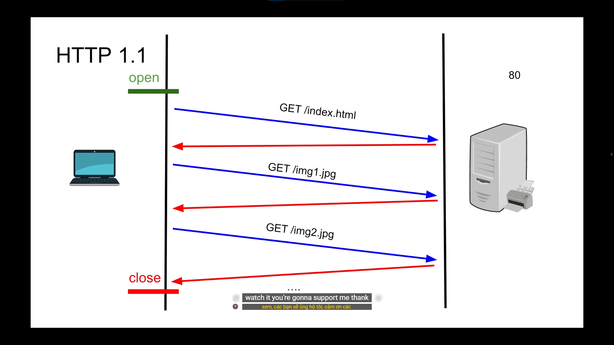

##### Agenda
- HTTP Anatomy
- HTTP 1.0 over TCP
- HTTP 1.1 over TCP
- HTTP/2 over TCP
- HTTP/2 over QUIC (HTTP/3)

##### Client/Server Architecture (easy)

##### HTTP
- Hyper Text Transfer Protocol is a protocol allows transfer datas like text, image, video or HTML file between client and server without encrytion (plaintext)

##### What things that a HTTP Server atually does ?
- Main tasks are communicating, transporting and navigating
- Read raw datas from layer Transport (TCP), parse it into standard HTTP
- Static file serving, it was optimized for reading file like CSS, HTML, ... and returning for client as quick as possible
- Edge security -> parse HTTPs to HTTP then push deep into system
- Navigating (reverse proxy & load balancing) -> determine what server should be retrieved

###### HTTP Request
- 4 parts:
  + URL
  + Method type
  + Headers
  + Body

###### HTTP Response
- 3 parts:
  + Status Code
  + Headers
  + Body

##### Basic Flow
+ HTTP

+ HTTPs

+ HTTP 1.0

  + New TCP connection with each request
  + Slow 
  + Buffering, accumulate whole datas from a request into RAM until finishing then doing transfer or handling
+ HTTP 1.1

  + Persisted TCP Connection
  + Low lantency
  + Streaming with Chunked transfer
  + Pipelining (disabled by default)
+ HTTP/2
  + Binary Framing
  + Multiplexing
  + Compression
  + Server Push
  + Secure (https) by default
  + Protocol Negotiation during TLS (NPN/ALPN)
+ HTTP/3 (still in the development stage)
  + Replaces TCP with QUIC (UDP with Congestion control)
  + All HTTP/2 features